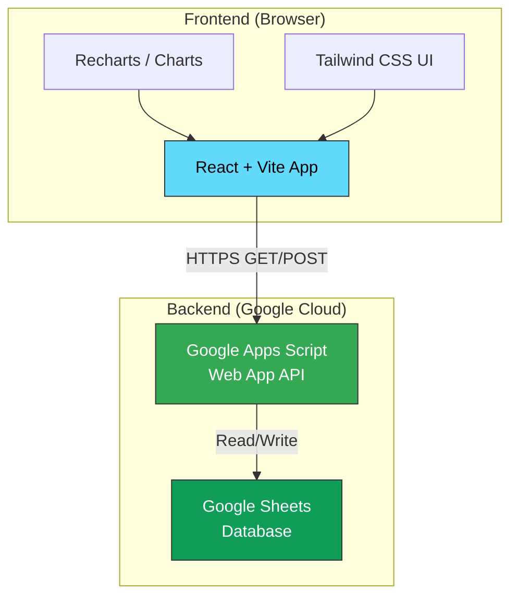

# 📦 Stock Inward Dashboard

> A modern inventory inlet management dashboard for tracking stock purchases, logistics costs, and supplier activity — powered by Google Sheets as the database and Google Apps Script as the API.

---

## 🏗️ Architecture



```
┌─────────────────────────────────────────────┐
│                  Frontend                   │
│  React + Vite + Tailwind CSS + Recharts     │
│  ┌─────────────────────────────────────┐    │
│  │  Dashboard  │  Add Entry  │  History │   │
│  └─────────────────────────────────────┘    │
└──────────────────┬──────────────────────────┘
                   │ HTTPS (fetch)
                   ▼
┌─────────────────────────────────────────────┐
│          Google Apps Script API              │
│  doGet()  │  doPost()                       │
│  ┌─────────────────────────────────────┐    │
│  │ getPurchases │ addPurchase           │   │
│  │ getAnalytics │ getDashboardData      │   │
│  │ seedSampleData                       │   │
│  └─────────────────────────────────────┘    │
└──────────────────┬──────────────────────────┘
                   │ SpreadsheetApp
                   ▼
┌─────────────────────────────────────────────┐
│           Google Sheets (Database)          │
│  ┌───────────────────┐ ┌─────────────────┐  │
│  │ Purchase_Headers  │ │ Purchase_Items  │  │
│  │ (master records)  │ │ (line items)    │  │
│  └───────────────────┘ └─────────────────┘  │
└─────────────────────────────────────────────┘
```

---

## ✨ Features

### Core Functionality
- **Add Purchases** — Record stock inward entries with multiple line items
- **View Purchase History** — Browse, filter, and search all purchase records
- **Dashboard Overview** — At-a-glance today's stats, weekly/monthly trends
- **Analytics** — Daily, weekly, and monthly analytics with commodity breakdowns

### Data Management
- **Multiple Commodities** — Each purchase can contain multiple products
- **Supplier Tracking** — Track purchases by supplier with search/filter
- **Logistics Separation** — Logistics charges tracked separately from product costs
- **Auto-calculated Totals** — Subtotals and grand totals computed automatically

### Reporting & Export
- **Google Sheets as Database** — Data is always accessible in familiar spreadsheet format
- **Excel/CSV Export** — Download data directly from Google Sheets
- **Pivot Tables** — Create custom reports using Google Sheets' built-in tools
- **CA-Friendly** — Data structure designed for easy handoff to accountants

### Technical
- **Zero Server Costs** — Runs entirely on Google's free infrastructure
- **Real-time Data** — Every API call reads fresh data from the sheet
- **Batch Operations** — Optimised read/write using `getValues()` / `setValues()`
- **Sample Data Seeding** — One-click population of 28 realistic test entries

---

## 🛠️ Tech Stack

| Layer | Technology |
|-------|-----------|
| **Frontend** | React 18, Vite, Tailwind CSS, Recharts |
| **API** | Google Apps Script (V8 Runtime) |
| **Database** | Google Sheets |
| **Hosting** | Vercel / Netlify / GitHub Pages (frontend) |
| **Auth** | Google OAuth 2.0 (optional, for future features) |

---

## 🚀 Quick Start

### 1. Set Up the Backend

```bash
# No installation needed — the backend runs in Google's cloud
# Follow the setup guide:
```

📖 **[google-apps-script/SETUP.md](google-apps-script/SETUP.md)** — Complete step-by-step guide

**Quick version:**
1. Create a Google Sheet with two tabs: `Purchase_Headers` and `Purchase_Items`
2. Open Extensions → Apps Script
3. Paste the contents of `google-apps-script/Code.gs`
4. Update `SPREADSHEET_ID` with your sheet's ID
5. Deploy → New Deployment → Web App → Anyone → Deploy
6. Copy the deployment URL

### 2. Seed Sample Data

Open in your browser:
```
https://script.google.com/macros/s/YOUR_DEPLOYMENT_ID/exec?action=seedSampleData
```

### 3. Set Up the Frontend

```bash
# Install dependencies
npm install

# Create environment file
echo "VITE_GOOGLE_APPS_SCRIPT_URL=https://script.google.com/macros/s/YOUR_ID/exec" > .env

# Start development server
npm run dev
```

### 4. Open the Dashboard

Visit `http://localhost:5173` in your browser.

---

## 📁 Project Structure

```
stock-inward-dashboard/
├── README.md                          # This file
├── .env                               # Environment variables (create this)
├── .gitignore                         # Git ignore rules
├── package.json                       # Node.js dependencies
├── vite.config.js                     # Vite configuration
│
├── google-apps-script/                # Backend (Google Apps Script)
│   ├── Code.gs                        # Main API code
│   ├── appsscript.json                # Apps Script manifest
│   └── SETUP.md                       # Setup instructions
│
├── docs/                              # Documentation
│   ├── API.md                         # API reference
│   ├── DEPLOYMENT.md                  # Deployment guide
│   └── EXPORT_GUIDE.md                # Data export guide
│
├── src/                               # Frontend source code
│   ├── main.jsx                       # Entry point
│   ├── App.jsx                        # Root component
│   ├── api/                           # API service layer
│   ├── components/                    # React components
│   ├── pages/                         # Page components
│   ├── hooks/                         # Custom hooks
│   └── utils/                         # Utility functions
│
├── public/                            # Static assets
└── dist/                              # Production build (generated)
```

---

## ⚙️ Environment Setup

### Required Environment Variables

Create a `.env` file in the project root:

```env
# Required: Your deployed Google Apps Script URL
VITE_GOOGLE_APPS_SCRIPT_URL=https://script.google.com/macros/s/AKfycbx.../exec

# Optional: Google OAuth Client ID (for future auth features)
VITE_GOOGLE_CLIENT_ID=your-client-id.apps.googleusercontent.com
```

### Google Sheet Column Setup

**Purchase_Headers:** `Purchase_ID | Billing_Date | Voucher_Number | Supplier_Name | Logistics_Charges | Product_Subtotal | Notes | Created_At`

**Purchase_Items:** `Purchase_ID | Commodity_Name | Quantity | Unit | Unit_Price | Subtotal`

---

## 📊 API Endpoints

| Method | Action | Description |
|--------|--------|-------------|
| GET | `getDashboardData` | Dashboard summary (today, weekly, monthly) |
| GET | `getPurchases` | List purchases with filters & pagination |
| GET | `getAnalytics` | Aggregated analytics (daily/weekly/monthly) |
| GET | `seedSampleData` | Populate with 28 sample entries |
| POST | `addPurchase` | Create a new purchase entry |

📖 **[docs/API.md](docs/API.md)** — Full API reference with request/response examples

---

## 🗓️ Future Roadmap (Phase 2 Preview)

### Planned Features

| Feature | Description | Priority |
|---------|-------------|----------|
| **Google Sign-In** | Authenticate users via Google OAuth | High |
| **Multi-user Support** | Role-based access (Admin, Viewer, Data Entry) | High |
| **Purchase Returns** | Track returned/defective items | Medium |
| **PDF Invoices** | Generate printable purchase receipts | Medium |
| **Barcode Scanning** | Scan product barcodes for quick entry | Medium |
| **Stock Levels** | Track current inventory (inward - outward) | High |
| **Outward Module** | Track stock dispatched/sold | High |
| **Low Stock Alerts** | Email notifications for low inventory | Medium |
| **Supplier Ledger** | Track payments and outstanding amounts | Low |
| **Multi-warehouse** | Support multiple storage locations | Low |
| **Bulk Import** | Upload CSV/Excel to add entries in bulk | Medium |
| **Audit Trail** | Track who added/edited/deleted entries | Medium |
| **Mobile App** | React Native or PWA for on-the-go entry | Low |

### Phase 2 Architecture (Planned)

```
Current:   Google Sheets ← Apps Script ← React
Phase 2:   Google Sheets ← Apps Script ← React
           + Google OAuth for authentication
           + Stock_Outward sheet for dispatches
           + Inventory_Levels computed view
           + Email triggers for low stock
```

---

## 📄 Documentation

| Document | Description |
|----------|-------------|
| [SETUP.md](google-apps-script/SETUP.md) | Step-by-step backend setup |
| [API.md](docs/API.md) | API reference with examples |
| [DEPLOYMENT.md](docs/DEPLOYMENT.md) | Production deployment guide |
| [EXPORT_GUIDE.md](docs/EXPORT_GUIDE.md) | Data export for accountants/CAs |

---

## 📝 License

This project is licensed under the **MIT License**.

```
MIT License

Copyright (c) 2026

Permission is hereby granted, free of charge, to any person obtaining a copy
of this software and associated documentation files (the "Software"), to deal
in the Software without restriction, including without limitation the rights
to use, copy, modify, merge, publish, distribute, sublicense, and/or sell
copies of the Software, and to permit persons to whom the Software is
furnished to do so, subject to the following conditions:

The above copyright notice and this permission notice shall be included in all
copies or substantial portions of the Software.

THE SOFTWARE IS PROVIDED "AS IS", WITHOUT WARRANTY OF ANY KIND, EXPRESS OR
IMPLIED, INCLUDING BUT NOT LIMITED TO THE WARRANTIES OF MERCHANTABILITY,
FITNESS FOR A PARTICULAR PURPOSE AND NONINFRINGEMENT. IN NO EVENT SHALL THE
AUTHORS OR COPYRIGHT HOLDERS BE LIABLE FOR ANY CLAIM, DAMAGES OR OTHER
LIABILITY, WHETHER IN AN ACTION OF CONTRACT, TORT OR OTHERWISE, ARISING FROM,
OUT OF OR IN CONNECTION WITH THE SOFTWARE OR THE USE OR OTHER DEALINGS IN THE
SOFTWARE.
```
